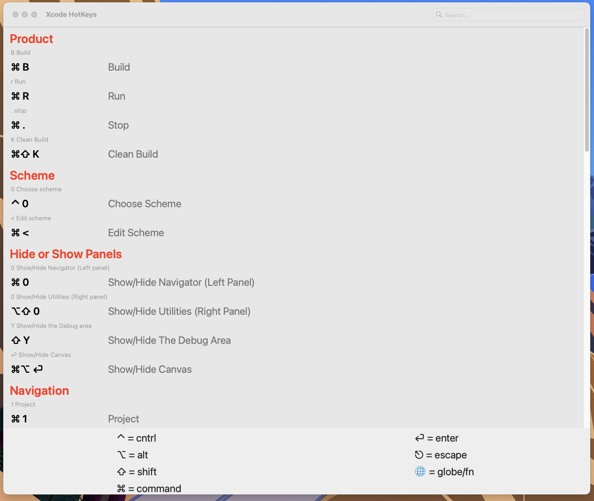
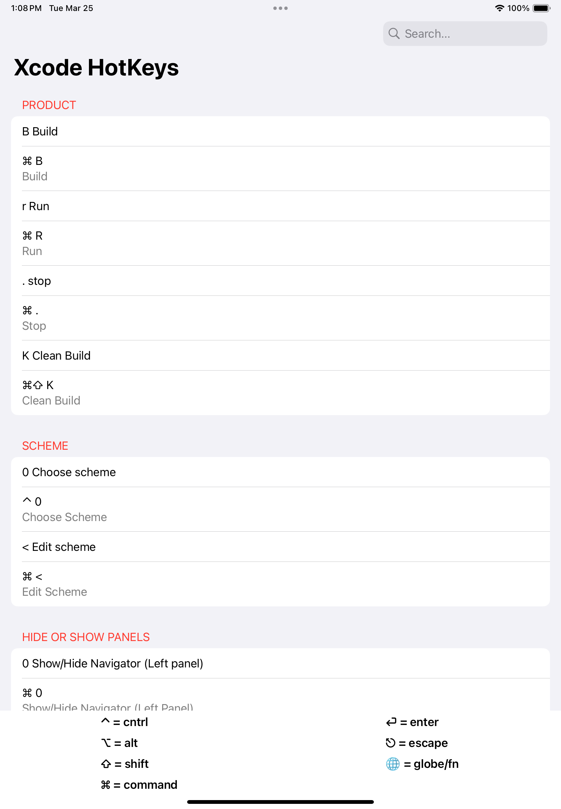
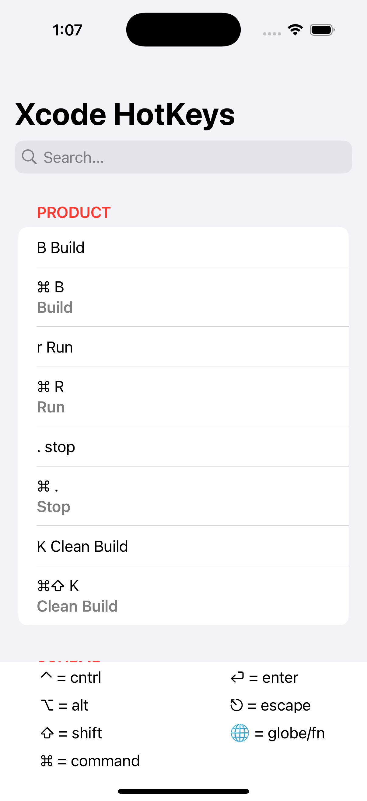

# XKeymap

XKeymap is an app that provides a reference for Xcode keyboard shortcuts, allowing developers to quickly find and use hotkeys for improved efficiency. The app supports **iPhone, iPad, and Mac**, with an adaptive theme and layout optimized for each device.

## Features

🔍 **Searchable Hotkeys**
- Quickly find any Xcode shortcut with an intuitive search interface.

🎨 **Adaptive Theme**
- Custom layouts designed specifically for iPhone, iPad, and Mac.
- Seamless visual experience across different Apple devices.

📌 **Categorized Shortcuts**
- Organized sections for easy navigation and quick reference.
- Logically grouped keyboard shortcuts for enhanced usability.

💻 **Mac & iPad Support**
- Fully optimized layout for each platform.
- Responsive design that adapts to different screen sizes and input methods.

## Screenshots

### Mac


### iPad


### iPhone


## Installation

### 1. Clone the Repository

```bash
git clone https://github.com/anup810/XKeymap.git
cd XKeymap
```

### 2. Open the Project in Xcode

```bash
open XKeymap.xcodeproj
```

### 3. Run the App

- Select the desired scheme (iPhone, iPad, Mac)
- Press `Cmd + R` to run the app

This project is licensed under the MIT License. 

